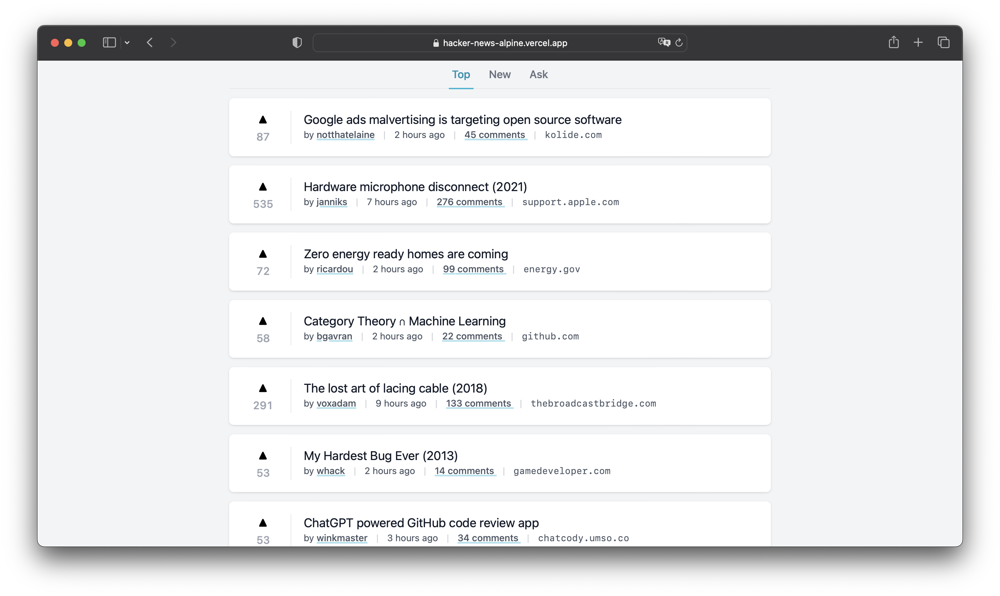

# Creando un clon de Hacker News con Alpine.js y Tailwind CSS

En este repositorio tienes todo lo necesario para aprender a crear un clon de la famosa página web **Hacker News** utilizando las tecnologías **Alpine.js** y **Tailwind CSS**.

## Demo

https://hacker-news-alpine.vercel.app

## ¿Qué es Hacker News?

Hacker News es una página web de noticias y discusión de tecnología. Fue creada por Paul Graham en 2007 y es una de las páginas web más populares de la red. En ella se publican noticias sobre tecnología, programación, ciencia, etc. y se pueden comentar y votar.

https://news.ycombinator.com/

## ¿Qué es Alpine.js?

Alpine.js es un framework JavaScript ligero y de bajo nivel que te permite crear componentes reactivos sin necesidad de escribir código JavaScript. Es una alternativa a frameworks como React, Vue o Angular.

Su principal ventaja es que es muy fácil de aprender y de utilizar. Su sintaxis es muy similar a la de Vue.js o Angular, por lo que si ya conoces alguno de estos frameworks, aprenderás Alpine.js en muy poco tiempo.

https://alpinejs.dev/

## ¿Qué es Tailwind CSS?

Tailwind CSS es una biblioteca (utility-first) de clases CSS que te permite crear interfaces de usuario modernas y responsivas sin necesidad de escribir código CSS, puesto que todo se hace mediante clases.

https://tailwindcss.com/

## Funcionalidades del sitio web

Este clon de Hacker News tiene las siguientes características:

- Interfaz de usuario responsive y moderna
- Lista de artículos ordenados por popularidad

### Tareas pendientes

- Paginación para facilitar la navegación por la lista de artículos
- Agregar Vite para mejorar la Developer Experience

## Cómo usar el proyecto

Para usar este proyecto, sigue estos sencillos pasos:

- Descarga o clona el repositorio desde Github.
- Abre el archivo `index.html` con **Live Server**.
- Explora el sitio web y disfruta de las funcionalidades.

## Contribuir al proyecto

¡Estamos buscando contributors para mejorar este proyecto!  
Si tienes alguna idea o sugerencia, si encuentras un error, o si simplemente quieres contribuir, ¡estaré encantado de recibir tu ayuda!

Para contribuir, sigue estos pasos:

- Deja tu estrellita de GitHub.
- Haz un fork de este repo.
- Crea una rama.
- Realiza tus cambios y haz un commit.
- Haz push a tu rama.
- Crea una PR.

## Redes sociales

Sígueme en mis redes sociales para estar al día con mis proyectos y novedades:

- Twitter: [@baumannzone](https://twitter.com/baumannzone)
- Instagram: [@baumannzone](https://www.instagram.com/baumannzone/)
- LinkedIn: [baumannzone](https://www.linkedin.com/in/baumannzone/)

## ¿Te gusta el proyecto?

🙏 ¡Ayúdame a difundirlo dejando una estrellita en Github! También puedes compartir el proyecto con tus amigos y colegas en redes sociales para que más personas puedan aprender a crear clon de Hacker News con Alpine.js y Tailwind CSS.

---

¡Gracias por leer hasta aquí! Espero que disfrutes del proyecto y que te animes a contribuir. ¡Hasta la próxima! 😎💻👨‍💻
